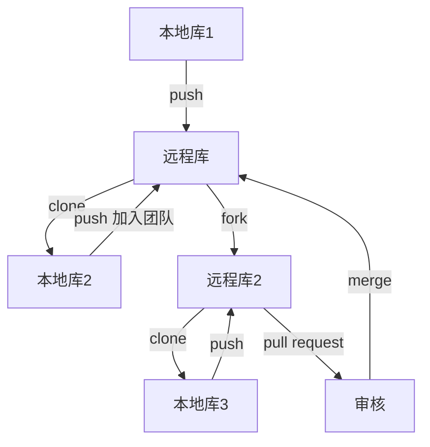

# 学习Git

## 1. 安装Git for windows

全部默认选项

## 2. Git结构

* 本地库：历史版本
* 暂存区：临时储存  git commit
* 工作区：写代码 git add

## 3. Git 托管中心-维护远程库

* 局域网 Gitlab服务器
* 外网 github gitee

## 4. 本地库和远程库



##  5. git bash 操作

### 5.1	git init

​	初始化得到 .git/文件夹，不要修改，不要

### 5.2 设置签名

​	形式：

* 用户名: zw
* Email: example@xxx.com
* 作用：区分开发人员身份
* 命令两个级别：
  * 项目级别：当前库有效 `git config user.name tom_pro` or email
  * 系统用户级别：当前操作系统用户 `--global`
  * 级别和优先级：就近原则，项目级别优与系统级别
  * 信息保存位置：当前目录下 `.git/config` 系统级别在 `~/.gitconfig`

```bash
git init 
git config user.name zw
git config user.email zw@pc.com
git --global config user.name zw
git --global config user.email zw@pc.com
```


### 5.3 git status

```bash
git add [filename] #暂存区 
git rm --cached [filename] #删除暂存区文件
git commit -m "some mesage"#提交
git status


```

### 5.4 查看历史

```bahs
git log --pretty=oneline
git log --oneline
git reflog
```

### 5.5 版本回退

```bash
git reset --hard [xxxxxx]
git reset --hard HEAD^^
git reset --hard HEAD~3
```

* 三个参数:
  * --hard :本地库移动HEAD指针,重置缓存区,重置工作区
  * --mixed:本地库移动HEAD指针,重置缓存区
  * --soft:仅仅本地库移动HEAD指针

### 5.6 比较文件差异

```bash
git diff [filename] #比较一个文件差异,与暂存区比较
git diff [filename] HEAD^ #和本地库比较
git diff #所有文件比较
```

### 5.7 git 分支

* 多条线同时推进多个任务
* 提高开发效率,各个分支开发过程独立


```bash
git branch -v #查看当前分支
git branch new_branch #创建新分支
git checkout new_branch #切换分支
git merge new_branch #合并分支
```

* 解决合并时冲突
  * 编辑文件,删除特殊符合
  * 修改文件,保持退出
  * git add filename
  * git commit, 
    FAQ:此时commit一定不能带文件名

### 5.8 删除

```bash
rm -rf .git
```


## 6. github

* 注册账号,[github](www.github.com)

* 修改信息
* 创建远程仓库
* 提交和下载

```bash
git remote -v #查看
#添加别名
git remote add origin https://github.com/zevellong/zw_learn_blog.git
git push -u origin master #推送到远程库
git clone https://github.com/zevellong/zw_learn_blog.git #克隆到本地库
```

